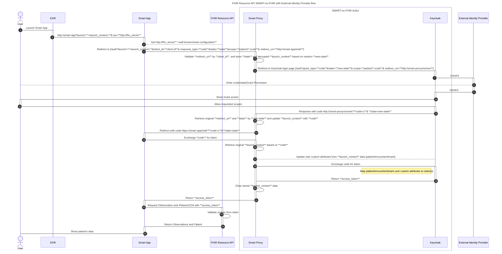

# SMART-on-Fhir Keycloak Proxy

This projects shows a reference implementation for a SMART-on-FHIR authentication server using Keycloak and an OAuth proxy that processes the SMART launch token.

### Running the application

The project requires .NET 8.0 SDK or later to build and uses .NET Aspire orchestration which requires a compatible container runtime such as Docker or Podman.

Have the `SmartOnFhirKeycloakProxy.AppHost` project set as startup project and run it. In the application dashboard, run the link for the `SmartOnFhirKeycloakProxy.ApiService` project which will link to the Rapidoc page.
Select the appropriate scopes and click the Get Token button.

Available scopes for client_id `ehr-app`: `user/Appointment.cruds`

Available scopes for client_id `smart-app`: `launch/patient`, `patient/Appointmet.crus`

Available users: `user1`, `user2`, `adm1` and `adm2` - all have the password `test`. 
